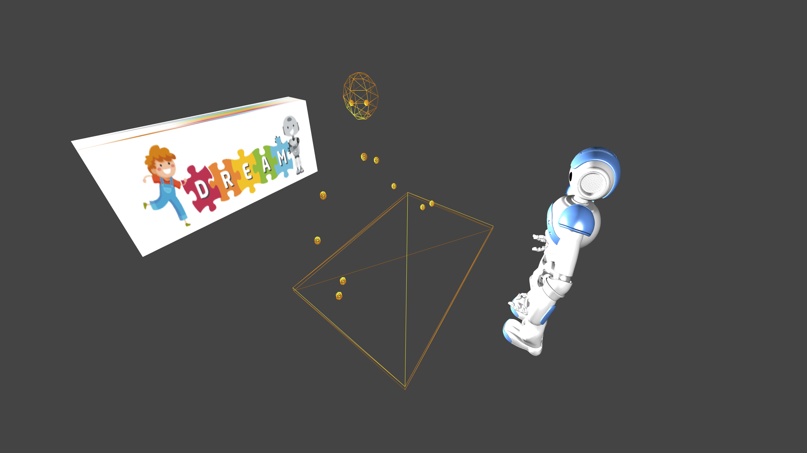

# DREAM Data Visualizer

_WebGL visualisation of the [DREAM dataset](https://github.com/dream2020/data)._

Within the European research project [DREAM: Development of Robot-Enhanced therapy for children with AutisM spectrum disorders](http://www.dream2020.eu), a large evaluation of _Robot Assisted Therapy (RAT)_ has been conducted, compared to _Standard Human Treatment (SHT)_. Both conditions follows a _Applied Behavior Analysis (ABA)_ protocol. 76 children diagnosed with _Autism Spectrum Disorders (ASD)_ participated, going through a total of almost 4000 therapy sessions and more than 360 hours of therapy. Each session was recorded with three RGB cameras and two RGBD (Kinect) cameras, providing detailed information of children's behavior during therapy. 

This public release of the dataset does not include any fotage of children. Instead, processed features of the recorded data is provided. This data is produced using an integrated sensor system developed within DREAM. Please refer to [github.com/dream2020/sensors](https://github.com/dream2020/sensors) for more information.  

The dataset itself is available at [github.com/dream2020/data](https://github.com/dream2020/data). Here, you find a WebGL visualisattion of the dataset, allowing playback of a recorded intervention session. 

## Installation and Usage

This visualiser is implemented using [Node.js](https://nodejs.org/en/) and [Three.js](https://threejs.org/). Assuming you have Git, Node and Npm installed, you may download and run the visualiser locally using the following steps:

~~~~
git clone https://github.com/dream2020/DREAM-data-visualizer.git
cd DREAM-data-visualizer/
npm install
npm start
~~~~

Finally, the visualizer is accessed in your webbrowser: http://localhost:3041/

The current version of the visualiser plays a single therapy session available in the pre-release of the [DREAM dataset](https://github.com/dream2020/data). More sessions will be available when the full version of the dataset is releaqsed.

## Licence

Unless otherwise specified, all software created as Copyright &copy; DREAM Data Visualiser is to be regarded as Open Source under the [GPLv3 licence](https://www.gnu.org/licenses/gpl.txt). The visualiser make use of a 3D model of the Nao robot that is non-free and may be accuired from [Turbosquid](https://www.turbosquid.com/3d-model/nao-robot).

## Acknowledgment

This work is part of the [DREAM project](http://www.dream2020.eu) funded by the European Commission’s Seventh Framework Program (FP7), grant #611391.